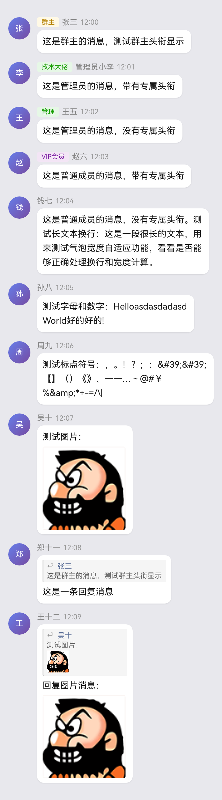

<div align="center">

# ✨ Quotly - 语录图片生成器


**将 QQ 群聊消息渲染为精美的引用图片**

复刻自 Telegram 著名的 [quote-bot](https://github.com/quote-bot)，为 AstrBot的QQ适配器带来同样的体验

</div>

---

## 📖 功能介绍

Quotly 是一款专为 AstrBot 的QQ适配器设计的语录图片生成插件，可以将群聊中的精彩对话瞬间定格为精美的分享图片。

### 🌟 核心亮点

- **🎨 QQ 聊天气泡 1:1 复刻** - 完美还原 QQ 群聊界面风格，群头衔、群名片一目了然
- **📸 多条消息拼接** - 支持连续引用多条消息，完整保留对话脉络
- **👤 用户消息过滤** - 支持按用户筛选消息，只获取指定用户的发言记录
- **🎯 精选消息组合** - 支持按序号精确选择消息，自由组合对话顺序
- **📅 日期智能分隔** - 跨日期消息自动显示日期分隔线，时间线清晰明了
- **💬 消息内回复** - 支持显示消息内部的回复引用，还原真实对话场景
- **🔍 智能语录检索** - 基于关键词、用户 ID 搜索已保存的语录记录
- **🤖 LLM 工具集成** - 可与 AstrBot 的 AI 助手联动，让 AI 也能搜索和随机展示语录
- **🎯 相似语录检测** - 基于感知哈希算法，自动识别并提示相似语录，避免重复保存
- **📝 OCR 文字识别** - 可选启用图片 OCR，让语录中的图片文字也能被搜索到
- **📤 图片直传上传** - 通过 `/qm` 指令直接上传图片到语录库，无需渲染即可保存
- **⚡ 自定义触发词** - 支持设置无斜杠触发词，让使用更加便捷
- **🪶 轻量渲染引擎** - 使用 html2pic 替代 Playwright，无需安装浏览器，pip 即装即用

---

## 🚀 快速开始

### 安装依赖

```bash
pip install -r requirements.txt
```

> 本插件使用 **html2pic**（基于 Skia + Taffy + HarfBuzz）作为渲染引擎，无需安装浏览器。  
> 首次运行时会自动从 CDN 下载 HarmonyOS Sans SC 字体文件。

### 系统依赖

html2pic 底层依赖 Skia（图形渲染）和 fontconfig（字体发现），在部分 Linux 环境下需要手动安装系统库。

#### Debian / Ubuntu

```bash
sudo apt-get update && sudo apt-get install -y \
    libfontconfig1 \
    libgl1 \
    libx11-6 \
    libx11-6
```

> Ubuntu 22.04 及更早版本使用 `libgl1-mesa-glx` 替代 `libgl1`。

#### Alpine Linux（常见于 Docker 精简镜像）

```bash
apk add --no-cache \
    fontconfig \
    mesa-gl \
    libx11 \
    libxext
```

#### CentOS / RHEL / Fedora

```bash
sudo yum install -y \
    fontconfig \
    mesa-libGL \
    libX11 \
    libXext
```

#### macOS / Windows

无需额外安装系统依赖，pip 安装后即可使用。

#### Docker

若 AstrBot 运行在 Docker 中，在 `Dockerfile` 中添加系统依赖：

```dockerfile
# Debian/Ubuntu 基础镜像
RUN apt-get update && apt-get install -y \
    libfontconfig1 libgl1 libx11-6 libxext6 \
    && rm -rf /var/lib/apt/lists/*

# Alpine 基础镜像
# RUN apk add --no-cache fontconfig mesa-gl libx11 libxext
```

> 如果遇到 `ImportError`、`libSkia*.so not found` 或渲染报错，请先确认已安装上述系统依赖。详见下方 [常见问题](#-常见问题) 章节。

### 推荐安装消息记录器

🌟 **强烈推荐**安装 [astrbot_plugin_message_recorder](https://github.com/leafliber/astrbot_plugin_message_recorder) 插件以获得最佳体验：

- **更稳定的历史消息获取** - 无依赖 OneBot API 的历史消息接口
- **跨平台支持** - 未来可支持 Telegram、Discord 等平台

> Quotly 会自动通过 OneBot API 获取群成员的头衔、名片等信息，无需额外配置 message_recorder。

> 如果未安装 message_recorder 插件，Quotly 会自动降级使用 OneBot API 获取消息，功能不受影响但仅支持 QQ 平台。

### 系统要求

| 项目 | 最低要求 | 推荐配置 |
|------|---------|---------|
| **操作系统** | Linux / macOS / Windows | Linux (Ubuntu 20.04+) / macOS 11+ |
| **内存** | 128 MB 可用内存 | 256 MB+ 可用内存 |
| **磁盘空间** | 50 MB | 100 MB+ |
| **系统库** (仅 Linux) | fontconfig, OpenGL/GLX, libX11 | 见上方安装命令 |

### 基础用法

| 命令 | 说明 | 示例 |
|------|------|------|
| `/q` | 回复消息生成语录图片 | 回复消息后发送 `/q` |
| `/q 5` | 引用 5 条连续消息 | 回复消息后发送 `/q 5` |
| `/qsearch <关键词>` | 搜索语录记录 | `/qsearch 今天天气` |
| `/qsearch -u <QQ号>` | 搜索指定用户的语录 | `/qsearch -u 12345678` |
| `/qsearch -g <群号>` | 搜索指定群的语录 | `/qsearch -g 12345678` |
| `/qsearch -a` | 全局搜索（跨群） | `/qsearch 表情包 -a` |
| `/qrandom` | 随机获取一条语录 | `/qrandom` |
| `/qrandom -g <群号>` | 随机获取指定群的语录 | `/qrandom -g 12345678` |
| `/qstats` | 查看语录统计信息 | `/qstats` |
| `/qdel` | 删除语录（回复机器人发的语录图） | 回复语录图后发送 `/qdel` |
| `/qm` | 直接上传图片到语录库 | 发送 `/qm` 并附带图片，或回复图片消息后发送 `/qm` |

### 渲染选项

生成语录时可临时调整渲染效果：

```bash
/q --title 0    # 不显示群头衔
/q --time 1     # 显示消息时间
/q --date 1     # 显示日期分隔
/q --user       # 只获取被回复消息发送者的消息
/q --user 12345 # 只获取指定用户（QQ号12345）的消息
/q --pick 1,4,5,10  # 精选第1、4、5、10条消息（1为被回复的消息）
/q --pick 1-5       # 精选第1到第5条消息
/q --pick 1,3,5-8   # 支持混合格式
/q 3 --title 1 --time 0  # 组合使用
/q 5 --user --time 1     # 获取发送者的5条消息并显示时间
```

> **`--pick` 参数说明**：序号 1 表示被回复的消息，2、3、4... 表示之后更新的消息（序号越大消息越新）。消息按指定顺序渲染，支持逗号分隔和范围格式（如 `1-5`）。

---

## ⚙️ 配置说明

插件支持以下配置项，可在 AstrBot WebUI 中修改：

### 触发词配置

| 配置项 | 说明 | 默认值 |
|--------|------|--------|
| `q_trigger` | 生成语录的触发词（无需斜杠） | 空（不启用） |
| `qsearch_trigger` | 搜索语录的触发词 | 空 |
| `qrandom_trigger` | 随机语录的触发词 | 空 |
| `qm_trigger` | 上传图片的触发词 | 空 |

> 示例：设置 `q_trigger` 为 `语录`，则发送 `语录` 即可触发 `/q` 功能；设置 `qm_trigger` 为 `上传`，则发送 `上传`（附带图片）即可触发 `/qm` 功能

### 渲染选项

| 配置项 | 说明 | 默认值 |
|--------|------|--------|
| `show_title` | 显示群头衔（群主/管理员/专属头衔） | `true` |
| `show_time` | 显示消息发送时间 | `false` |
| `show_date` | 显示日期分隔线 | `false` |

### OCR 选项

| 配置项 | 说明 | 默认值 |
|--------|------|--------|
| `enable_ocr` | 启用图片 OCR 识别 | `false` |

> OCR 功能需要 AstrBot 配置视觉模型（如 GPT-4V）

### 权限选项

| 配置项 | 说明 | 默认值 |
|--------|------|--------|
| `qdel_require_admin` | 删除语录需要管理员权限 | `true` |

---

## 🎯 效果预览



---

## ❓ 常见问题

### Linux 下 `pip install` 报错 / 渲染失败

html2pic 依赖 Skia 图形库，Linux 上需要 fontconfig 和 OpenGL 相关系统库。请按照上方 [系统依赖](#系统依赖) 章节安装对应包后重试。

典型错误信息：
- `ImportError: libSkia.so: cannot open shared object file`
- `OSError: Cannot load Skia library`
- 渲染时报 `Skia error` 或空白输出

### Docker 容器内渲染失败

精简 Docker 镜像（如 `python:3.12-slim`、`alpine`）通常缺少图形库。在 `Dockerfile` 中添加：

```dockerfile
# Debian/Ubuntu 基础镜像
RUN apt-get update && apt-get install -y \
    libfontconfig1 libgl1 libx11-6 libxext6 \
    && rm -rf /var/lib/apt/lists/*
```

### 字体显示为方块 / 乱码

插件首次运行时会从 CDN 自动下载 HarmonyOS Sans SC 字体。如果服务器无法访问外网（`cdn.jsdelivr.net`），可手动下载字体文件：

| 字体 | 下载地址 |
|------|---------|
| HarmonyOS_Sans_SC_Regular.ttf | [下载](https://cdn.jsdelivr.net/gh/IKKI2000/harmonyos-fonts@latest/fonts/HarmonyOS_Sans_SC/HarmonyOS_Sans_SC_Regular.ttf) |
| HarmonyOS_Sans_SC_Medium.ttf | [下载](https://cdn.jsdelivr.net/gh/IKKI2000/harmonyos-fonts@latest/fonts/HarmonyOS_Sans_SC/HarmonyOS_Sans_SC_Medium.ttf) |
| HarmonyOS_Sans_SC_Bold.ttf | [下载](https://cdn.jsdelivr.net/gh/IKKI2000/harmonyos-fonts@latest/fonts/HarmonyOS_Sans_SC/HarmonyOS_Sans_SC_Bold.ttf) |

将字体文件放入 AstrBot 数据目录下的 `plugin_data/astrbot_plugin_quotly/fonts/` 文件夹即可。

---

## 🙏 致谢

本项目灵感来源于 Telegram 平台上广受喜爱的 [quote-bot](https://github.com/LyoSU/quote-bot)，感谢原作者创造的优雅设计理念。

特别感谢：
- **AstrBot** 团队提供的优秀插件开发框架
- **html2pic** 项目提供的轻量 HTML 渲染能力
- **HarmonyOS Sans** 字体带来的清晰中文渲染体验

---

## 📜 开源协议

本项目采用 AGPL-3.0 协议开源。

如有问题或建议，欢迎在 [GitHub Issues](https://github.com/leafliber/astrbot_plugin_quotly/issues) 提交反馈。

<div align="center">

**Made with 💖 by [leafliber](https://github.com/leafliber)**

</div>
